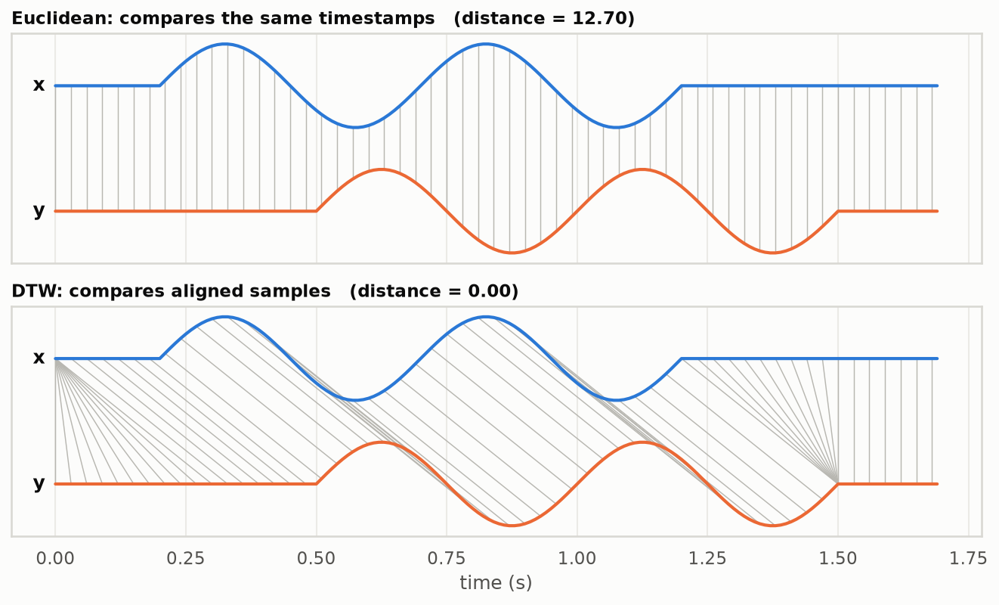
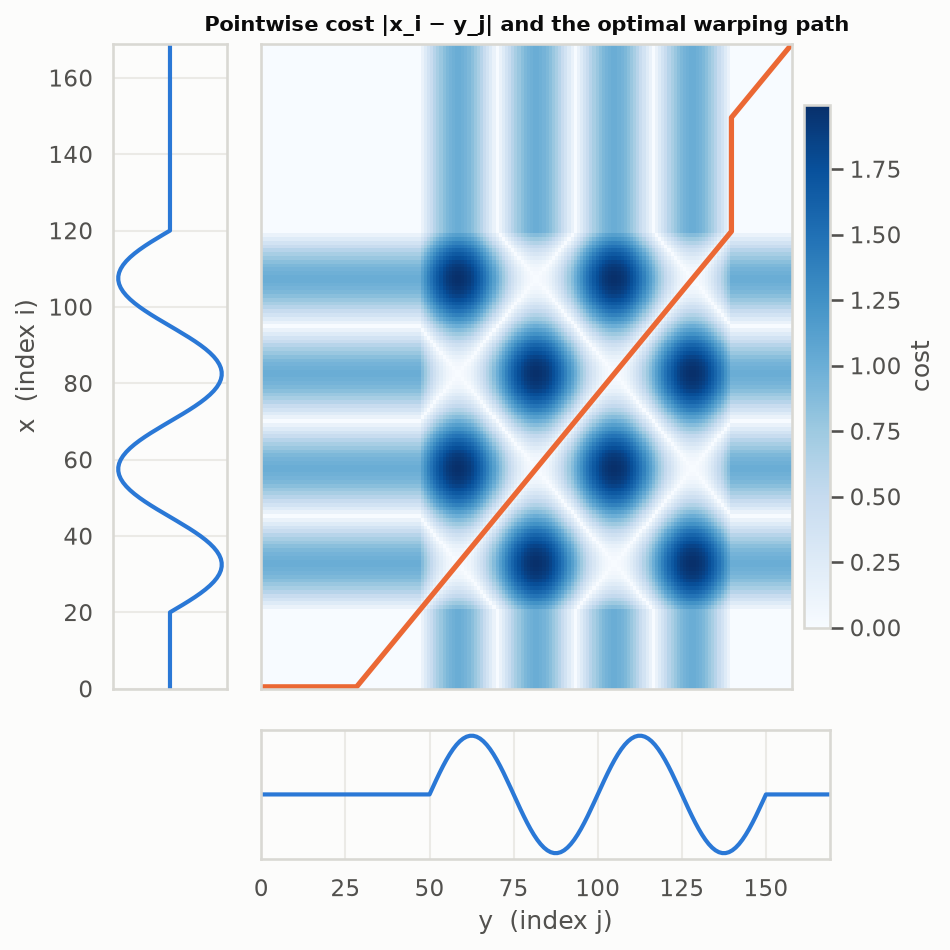
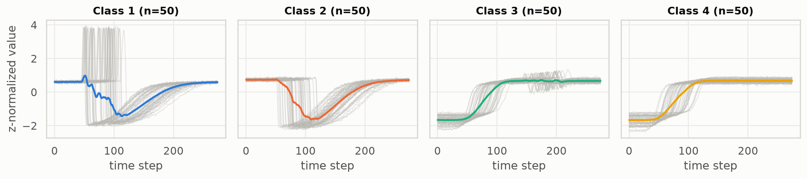
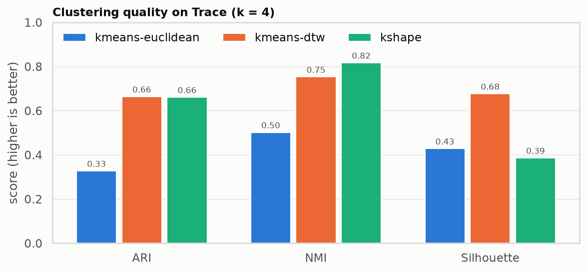
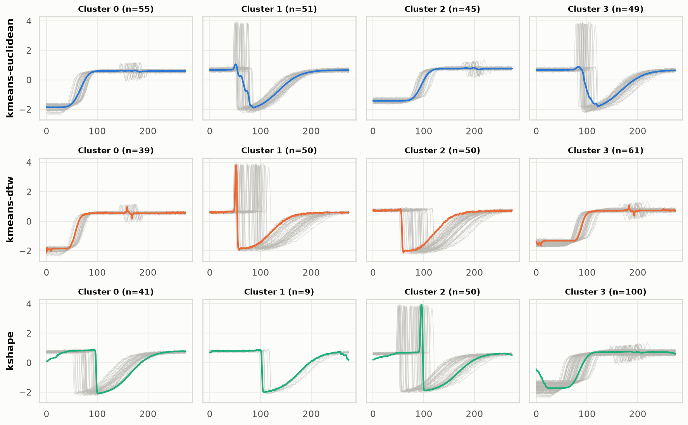
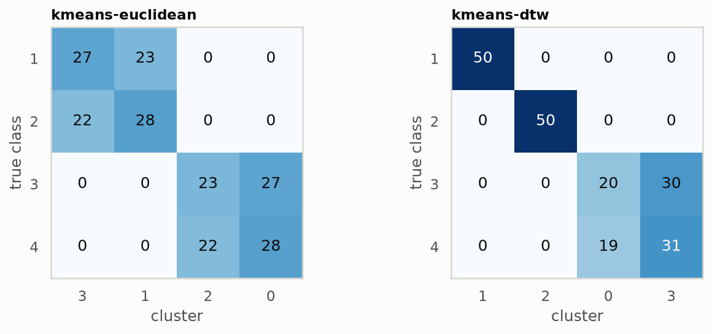

# Time Series Clustering

A personal reference for time series clustering. It covers distances, algorithms and evaluation, each as a small tested module plus a notebook that explains it. The experiments below are the quickest tour. Every figure is generated by the notebook named in its caption and saved in `reports/figures/`. See [ROADMAP.md](ROADMAP.md) for what comes next.

| Technique | Code | Notebook |
|---|---|---|
| Euclidean vs DTW intuition | `tslearn.metrics.dtw` | [`00-AGE90-introduction`](notebooks/00-AGE90-introduction.ipynb) |
| DTW from scratch, pluggable pointwise cost | `tsclustering.distances` | [`01-AGE90-dynamic_time_warping`](notebooks/01-AGE90-dynamic_time_warping.ipynb) |
| k-means (Euclidean, DTW/DBA), k-Shape on UCR Trace | `tsclustering.models.train_model.MODELS` | [`02-AGE90-kmeans_dtw`](notebooks/02-AGE90-kmeans_dtw.ipynb) |

---

## Experiments

### 1. Why Euclidean distance fails on time series

*Notebook 00.* The same wave, shifted by 0.3 s. The grey lines link the pairs of samples each distance compares.



Euclidean distance compares samples at the same timestamp, so a pure time shift reads as a large difference (12.7). **Dynamic time warping (DTW)** lets one series stretch or wait so that matching features line up, and the distance drops to 0. Clustering with DTW therefore groups series by **shape**, not by **timing**.

### 2. How DTW finds the alignment

*Notebook 01.* The heatmap is the cost of matching sample `x_i` with sample `y_j`. The orange line is the cheapest path from one corner to the other.



Along the diagonal, both series advance together. On the flat and vertical stretches, one series waits: that is where the shift gets absorbed. `tsclustering.distances.dtw_distance` implements this dynamic program in about 10 lines and is tested against `tslearn`.

### 3. The dataset: UCR Trace

*Notebook 02.* The dataset has 200 simulated instrument-failure signals in 4 classes. Grey lines are the individual series; the colored line is each class mean.



The classes come in look-alike pairs: **1 vs 2** is a drop with or without a short spike, and **3 vs 4** is a rise with or without a brief oscillation. Within each class, the event happens at a different time. That makes this dataset a clean test of shift-invariant clustering. The labels are used **only** to score the clusters.

### 4. Which model recovers the classes?

*Notebook 02.* The three models are all run with `k = 4` on z-normalized series. ARI and NMI compare the clusters with the true classes (1 = perfect, 0 = random). Silhouette measures cluster separation without labels.



| Model | ARI | NMI | Silhouette |
|---|---|---|---|
| kmeans-euclidean | 0.33 | 0.50 | 0.43 |
| kmeans-dtw | 0.66 | 0.75 | 0.68 (DTW distance) |
| kshape | 0.66 | 0.82 | 0.39 |

Warping the time axis (DTW) or allowing a shift (k-Shape) doubles the ARI over Euclidean k-means.

### 5. What each model actually found

*Notebook 02.* There is one row per model and one column per cluster. The members are grey and the cluster center is colored.



- **Euclidean** clusters by *when* the event happens (early drop, late drop, …), and its centroids are blurry averages.
- **DTW** separates the drop classes cleanly. Its barycenters (DBA) keep sharp edges because every series is aligned before averaging.
- **k-Shape** merges both rise classes into a single cluster of 100.

### 6. Where the errors are

*Notebook 02.* This contingency table shows the true classes (rows) against the clusters (columns), with the columns reordered so that a perfect result is a diagonal.



Euclidean k-means splits every pair roughly 50/50 by timing. DTW gets classes 1 and 2 exactly right, but the small oscillation that separates 3 from 4 is too faint, so those two are still split by timing. Next experiments to try are derivative DTW, a constrained warping window, and feature-based clustering (see [ROADMAP.md](ROADMAP.md)).

**Reproduce:** `make pipeline` reproduces the metrics. To regenerate the figures, run `uv run --with nbconvert jupyter nbconvert --execute --to notebook --inplace notebooks/*.ipynb`.

---

## Installation

Requires [uv](https://docs.astral.sh/uv/getting-started/installation/). uv installs Python 3.12 for you if it is missing.

```bash
git clone <repository-url>
cd time-series-clustering
make install                  # uv sync --all-groups: creates .venv with every dependency group
uv run pre-commit install     # optional: lint and format on every commit
```

Run any command inside the environment with `uv run <command>`, or activate it with `source .venv/bin/activate`. Add dependencies with `uv add <package>` (or `uv add --group <dev|test|notebook|data-science|viz> <package>`) and update them with `uv lock --upgrade && uv sync`.

---

## Usage

Run `make help` to list every task.

### Pipeline

Each step reads the previous step's output. The dataset name (`DATASET = "Trace"`) lives in `data/make_dataset.py`:

| Command | Module | Reads | Writes |
|---|---|---|---|
| `make data` | `data/make_dataset.py` | UCR archive (via tslearn) | `data/raw/Trace.npz` |
| `make features` | `features/build_features.py` | `data/raw/Trace.npz` | `data/processed/Trace.npz` (z-normalized) |
| `make train` | `models/train_model.py` | `data/processed/Trace.npz` | `models/<model>.joblib`, `reports/metrics_<model>.json` |
| `make predict` | `models/predict_model.py` | `models/kmeans-dtw.joblib` + processed data | `data/processed/Trace_clusters.csv` |

Pick a technique with `uv run python -m tsclustering.models.train_model --model {kmeans-euclidean,kmeans-dtw,kshape} [--n-clusters K]`. To add one, add an entry to `MODELS`.

`make pipeline` runs `data`, `features` and `train` in order.

### Code quality and tests

```bash
make check    # ruff format + ruff check + mypy
make test     # pytest with coverage
```

### Paths and data

Never hardcode paths. The helpers in `utils/paths.py` resolve from the project root, so they work the same in scripts, notebooks and tests:

```python
from tsclustering.data.data_loader import load_csv
from tsclustering.utils.paths import data_raw_dir, reports_figures_dir
from tsclustering.visualization.visualize import plot_distribution

df = load_csv(data_raw_dir("dataset.csv"))
plot_distribution(
    df["size"],
    title="Size distribution",
    xlabel="size",
    save_path=reports_figures_dir("size.png"),
)
```

### Notebooks

Start Jupyter Lab with `make notebook`. Put reusable code in `src/` and import it; add this at the top of a notebook to pick up code changes without restarting the kernel:

```python
%load_ext autoreload
%autoreload 2
```

---

## Project Structure

```text
├── CLAUDE.md               <- Project conventions for Claude Code
├── Makefile                <- Tasks: `make help`
├── pyproject.toml          <- Metadata, dependency groups and tool configuration
├── uv.lock                 <- Locked dependency versions
├── app/                    <- Application entry point (if applicable)
├── config/                 <- Configuration files
├── data/
│   ├── raw/                <- Original, immutable data
│   ├── interim/            <- Intermediate, cleaned data
│   ├── processed/          <- Final, model-ready data
│   └── external/           <- Data from third-party sources
├── docs/                   <- Developer guide and code of conduct
├── logs/                   <- Log files
├── models/                 <- Trained models
├── notebooks/              <- Exploration notebooks, named e.g. `01-abc-initial-eda.ipynb`
├── references/             <- Data dictionaries, manuals, papers
├── reports/figures/        <- Generated figures
├── scripts/                <- Helper shell scripts
├── src/tsclustering/
│   ├── credentials.py      <- Loads secrets from `.env`
│   ├── data/               <- Loading (`data_loader.py`) and cleaning (`make_dataset.py`)
│   ├── features/           <- Feature engineering helpers and `build_features.py`
│   ├── models/             <- Model helpers, `train_model.py`, `predict_model.py`
│   ├── utils/paths.py      <- Project-relative path helpers
│   └── visualization/      <- Plotting helpers
└── tests/                  <- `unit/` and `e2e/` tests
```

---

## Documentation

- [Developer Guide](docs/developer_guide.md): code style, testing, Git workflow and contributing
- [Code of Conduct](docs/code_of_conduct.md)

---

## License

This project is licensed under the MIT License. See the [LICENSE](LICENSE) file for details.
